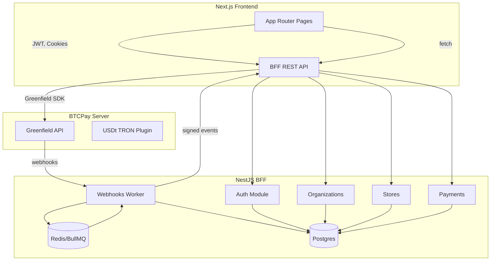

# PayPay Architecture

## Data Flow
1. **Authentication** – Merchant signs up via Next.js form. Payload is posted to `POST /api/auth/signup`. The BFF hashes the password with Argon2, stores the user, and responds with JWT access & refresh tokens.
2. **Organization context** – After login the frontend requests `GET /api/organizations/:userId`. The BFF resolves memberships and returns organization metadata without exposing API secrets.
3. **Store linkage** – Merchants provide a BTCPay Greenfield API Key. The BFF stores only a reference (`api_key_ref`) and proxies real requests via the typed SDK.
4. **Dashboard** – Next.js server components call the BFF for wallet balances, invoices, payouts and app listings. The BFF aggregates BTCPay data, caches via Redis, and returns JSON sans PII.
5. **Webhooks** – BTCPay emits signed webhook events. The BFF validates the signature, persists an idempotency log, and enqueues a BullMQ job. Workers fan out notifications and update aggregates.
6. **Email notifications** – Workers fetch store-specific email recipients and dispatch provider-specific notifications while ensuring no payment PII is logged.

## Security Posture
- JWT access tokens (15m) and refresh tokens (7d) with rotation.
- CSRF cookies for form routes, Helmet headers, and rate limiting at the edge.
- Strict env-based secrets: BTCPAY API key, webhook signing secret, JWT secrets, database credentials.
- Logs contain only high-level context (`storeId`, `invoiceId`) and exclude payer metadata.

## Deployment Snapshot
- **Frontend**: Next.js, SSR only for protected dashboards, served via Caddy/Traefik.
- **BFF**: NestJS with TypeORM, BullMQ worker, Swagger docs.
- **Postgres**: Stores user & organization metadata.
- **Redis**: Backing BullMQ queue and cache.
- **Reverse Proxy**: TLS termination, routing to frontend and BFF containers.
